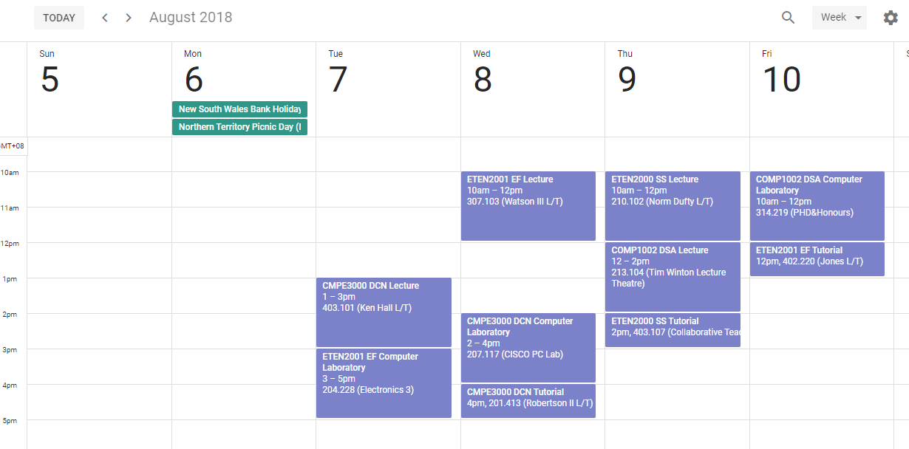

Elsie Scraper
======

## Online version!
I've ported ElsieScraper to function online, so you don't have to install it yourself.
https://proj.imjac.in/ta/elsie


Import your calendar from Elsie and export it to .ics, a format iCal, Google Calendar and MS Outlook can all understand.
```
PS D:\Programming\Uni\elsiescrape> ruby main.rb
Student ID:
19182065
Password:

Getting user...
Found User: 19182065

Getting timetable for 30 Jul 2018 -> 30 Dec 2018...
Saving Calendar...
Calendar saved to out/unitcalendar.ics!
```



## Using it
1. Clone this repository (or download it as a .zip)
2. Install Ruby
    - Mac: should already be installed. Optionally install with Homebrew (`brew install ruby`)
    - Linux (Debian/Ubuntu): `apt-get install ruby-full`  
    - Windows: https://rubyinstaller.org/  
3. Install the 'json' and 'icalendar' gems
    - `gem install json icalendar`
4. Run `ruby main.rb` and input your Student ID and Password
5. Import your calendar into Google Calendar, Outlook or iCal and enjoy. 

## Changing the study period
Open `main.rb` and change the `STUDY_START` and `STUDY_END` variables. Their parameters are ordered `YYYY, MM, DD`